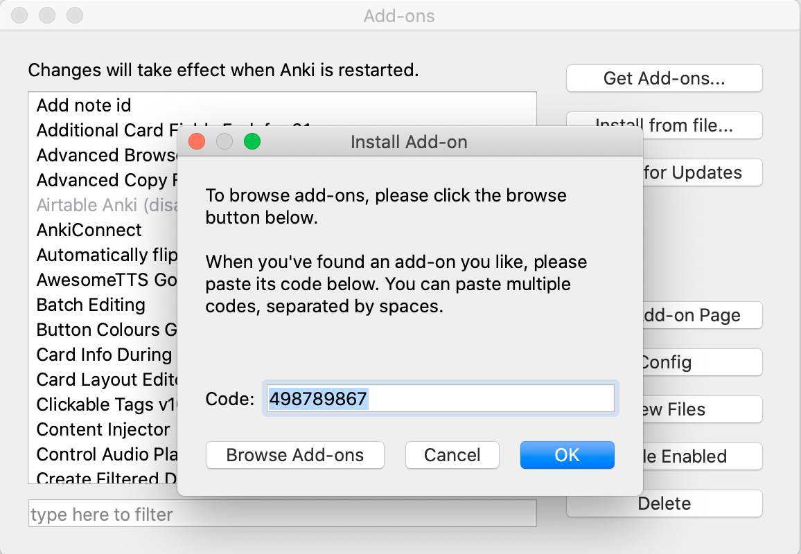

## Bộ 1000 câu căn bản tiếng Anh, tiếng Nhật

  <a href="https://drive.google.com/file/d/1ucINvF2OBP4QNsuWo0gPdnkwFTCG5GXN/view?usp=sharing">Download</a>

## Hướng dẫn chung để cài add-on

Để cài add-ons, trong Anki trên thanh menubar cả nhà chọn: `Tools > Add-ons > Get Add-ons...`\
Copy code của add-on vào hộp, ví dụ: `498789867`

Có một số add on không cài được theo cách này. Mình sẽ hướng dẫn riêng bên dưới.

## Danh sách add-on
<!-- vim-markdown-toc GFM -->

* [Replay Buttons on card](#replay-buttons-on-card)
* [Button Colours](#button-colours)
* [Control Audio Playback Speed](#control-audio-playback-speed)
* [Edit Field During Review](#edit-field-during-review)
* [Syntax Highlighting for Card Layout Editor](#syntax-highlighting-for-card-layout-editor)
* [Card Info During Review](#card-info-during-review)
* [Additional Card Fields](#additional-card-fields)
* [Advanced Browser Sidebar](#advanced-browser-sidebar)
* [Advanced Browser](#advanced-browser)
* [Fastbar](#fastbar)
* [Review Heatmap](#review-heatmap)
* [Reset Card Scheduling](#reset-card-scheduling)

<!-- vim-markdown-toc -->

## Replay Buttons on card

* [Replay buttons on card - AnkiWeb](https://ankiweb.net/shared/info/498789867): `498789867`\
    Làm xuất hiện nút chơi lại audio trên card

    

    
    

    
## Button Colours

* [Button Colours (Good, Again) - AnkiWeb](https://ankiweb.net/shared/info/2494384865): `2494384865`\
    Tô màu nút `Again` và `Good`
    
    

    
    

    
## Control Audio Playback Speed

* [Control Audio Playback Speed - AnkiWeb](https://ankiweb.net/shared/info/1067025219): `1067025219`\
    Thay đổi tốc độ audio, các phím tắt quan trọng:
    
    - `[` : giảm tốc độ bớt 10%
    - `]` : tăng tốc độ lên 10%
    - `p` (win) / `Backspace` (mac) : trở lại tốc độ bình thường
    - `n` : tạm dừng (pause) audio đang chơi, thích hợp khi tập đọc theo các đoạn ngắn
    - `m` : dừng hẳn (stop) audio đang chơi\
    
    Nếu bạn nào thấy nhấp `p` hay `backspace` mà audio không quay lại tốc độ bình thường thì sửa bằng cách download [file này](https://github.com/hieuvijjo/anki1000/blob/master/files/Audio_Controls.zip), giải nén ra, rồi copy đè như hướng dẫn bên dưới:
    
    

    
    

    
    Nhớ tắt anki đi và bật lại!
    
    Lưu ý: nếu cả nhà nhấp `n` rồi chuyển card ngay lập tức sẽ bị mất tiếng, cả nhà nhấp lại `n` lần nữa để có tiếng lại.
## Edit Field During Review

* [Edit Field During Review - AnkiWeb](https://ankiweb.net/shared/info/1020366288): `1020366288`\
    Chỉnh sửa card ngay trong lúc học.
    
    

    
    

## Syntax Highlighting for Card Layout Editor

* [Card Layout Editor - syntax highlighting, monospace font - AnkiWeb](https://ankiweb.net/shared/info/1483620388): `1483620388`\
    Hiện màu code khi sửa card.

    

    
    

## Card Info During Review

* [Card Info During Review - AnkiWeb](https://ankiweb.net/shared/info/2179254157): `2179254157`\
    Hiện thông tin cards khi review, bằng cách chọn `Tools > Card Stats`, hoặc nhấp phím tắt tương ứng.
    
    

    
    

## Additional Card Fields

* [Additional Card Fields (Fork for 2.1) - AnkiWeb](https://ankiweb.net/shared/info/744725736): `744725736`\
    Hiện thêm thông tin cần thiết ngay trên card.

    

    
    

## Advanced Browser Sidebar

* [Blitzkrieg: Advanced Browser Sidebar - AnkiWeb](https://ankiweb.net/shared/info/564851917): `564851917`\
    Đổi tên, sắp xếp, chỉnh sửa options cho các bộ cards ngay trong browser.

    

    
    

## Advanced Browser

* [Advanced Browser - AnkiWeb](https://ankiweb.net/shared/info/874215009): `874215009`\
    Hiện thêm cột thông tin cho Browser.

    

    
    

## Fastbar

* [Fastbar](files\1955978390.zip)\
    Add-on này không cài được bằng code, cả nhà download [file này](https://github.com/hieuvijjo/anki1000/blob/master/files/1955978390.zip) về, giải nén ra.\
    Sau đó chọn `Tools > Add-ons > Get Files`  và copy thử mục vừa giải nén vào đây.

    

    
    

    Nếu làm đúng, sau khi tắt Anki đi bật lại, cả nhà vào trong `Browse`, sẽ thấy `FastBar` hiện ra.

    

    
    

    
## Review Heatmap

* [Review heatmap](https://github.com/glutanimate/review-heatmap):\
    Add-on này cũng không cài được bằng code, cả nhà cần download file [tại đây](https://github.com/glutanimate/review-heatmap/releases), giống hướng dẫn bên dưới:
    
    

    
    

    
    Tiếp theo, cả nhà cài add-on bằng cách chọn `Tools > Add-ons` và kéo file vừa download vào giống thế này:
    
    

    
    

    Sau khi cài xong, tắt Anki đi bật lại cả nhà sẽ thấy `Heatmap` hiện ở cuối:

    

    
    

## Reset Card Scheduling

* [Reset Card Scheduling - AnkiWeb](https://ankiweb.net/shared/info/300884351): `300884351`\
    Reset lại các cards đã học.
    
    

    
    

