## Hướng dẫn chung để cài add-on

Để cài add-ons, trong Anki trên thanh menubar cả nhà chọn: `Tools > Add-ons > Get Add-ons...` 
Copy code của add-on vào hộp, ví dụ: `498789867`

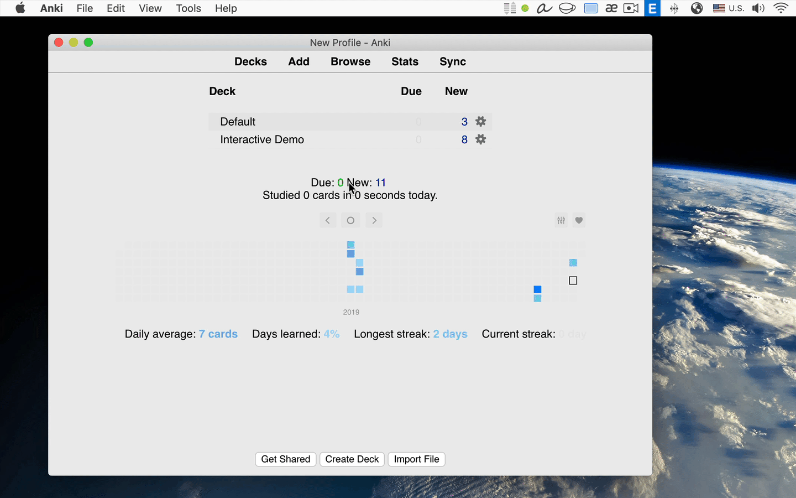

> **Lưu ý**: sau khi cài add-ons xong cả nhà cần **tắt Anki đi và bật lại**. Có thể tranh thủ cài nhiều add-ons một lượt xong đó tắt đi bật lại cũng được. 

Có một số add on không cài được theo cách này. Mình sẽ hướng dẫn riêng bên dưới.

## Danh sách add-on
<!-- vim-markdown-toc GFM -->
(Lưu ý, một số add-ons có thể không còn chạy trên Anki mới nhất)
* [Replay Buttons on card](#replay-buttons-on-card): (Anki phiên bản mới không cần) `498789867`
* [Button Colours](#button-colours): `2494384865`
* [Control Audio Playback Speed](#control-audio-playback-speed): (bị hỏng đừng cài) `1067025219`
* [Edit Field During Review](#edit-field-during-review): `1020366288`
* [Syntax Highlighting for Card Layout Editor](#syntax-highlighting-for-card-layout-editor): (không tương thích với Anki mới) `1483620388`
* [Card Info During Review](#card-info-during-review): `2179254157`
* [Additional Card Fields](#additional-card-fields): (không recommend cài nữa) `744725736`
* [Deck Stats](#deck-stats): `1421528223`
* [More Overview Stats](#more-overview-stats): `2116130837`
* [Review Heatmap](#review-heatmap)
* [Fastbar](#fastbar): `46611790`
* [Advanced Browser Sidebar](#advanced-browser-sidebar): (không tương thích với Anki mới nhất) `564851917`
* [Advanced Browser](#advanced-browser): `874215009`
* [Reset Card Scheduling](#reset-card-scheduling): `300884351`

<!-- vim-markdown-toc -->

## Replay Buttons on card

* [Replay buttons on card - AnkiWeb](https://ankiweb.net/shared/info/498789867): `498789867` 
    Làm xuất hiện nút chơi lại audio trên card

    

    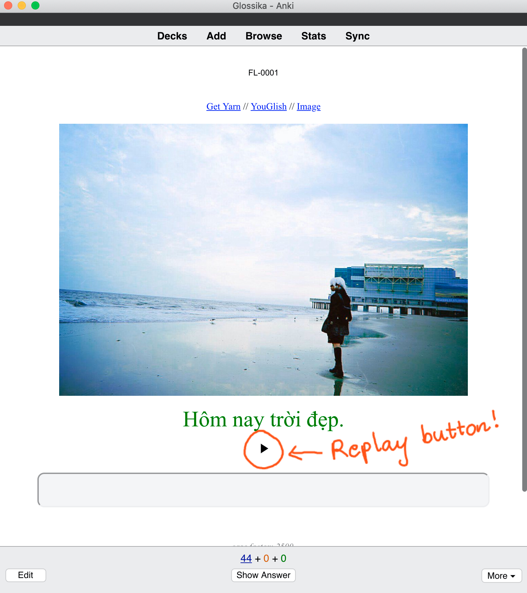
    

    
## Button Colours

* [Button Colours (Good, Again) - AnkiWeb](https://ankiweb.net/shared/info/2494384865): `2494384865` 
    Tô màu nút `Again` và `Good`
    
    

    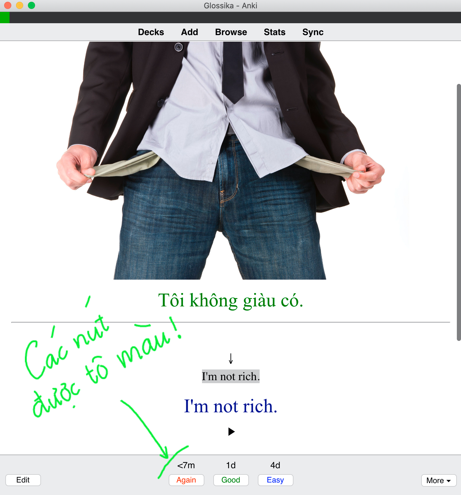
    

    
## Control Audio Playback Speed

* [Control Audio Playback Speed - AnkiWeb](https://ankiweb.net/shared/info/1067025219): `1067025219` 
    (Không còn tương thích với Anki mới, xin đừng cài!)
    Thay đổi tốc độ audio, các phím tắt quan trọng:
    
    - `[` : giảm 10% tốc độ ban đầu
    - `]` : tăng 10% tốc độ ban đầu
    - `p` (win) / `backspace/delete` (mac) : trở lại tốc độ bình thường
    - `n` : tạm dừng (pause) audio đang chơi, thích hợp khi tập đọc theo các đoạn ngắn
    - `m` : dừng hẳn (stop) audio đang chơi 

> **Lưu ý**: nếu cả nhà nhấp `n` rồi chuyển card ngay lập tức **sẽ bị mất tiếng**, cả nhà cần nhấp lại `n` lần nữa để có tiếng lại.

## Edit Field During Review

* [Edit Field During Review - AnkiWeb](https://ankiweb.net/shared/info/1020366288): `1020366288` 
    Chỉnh sửa card ngay trong lúc học.
    
    

    
    

## Syntax Highlighting for Card Layout Editor

* [Card Layout Editor - syntax highlighting, monospace font - AnkiWeb](https://ankiweb.net/shared/info/1483620388): `1483620388` 
    Hiện màu code khi sửa card.

    

    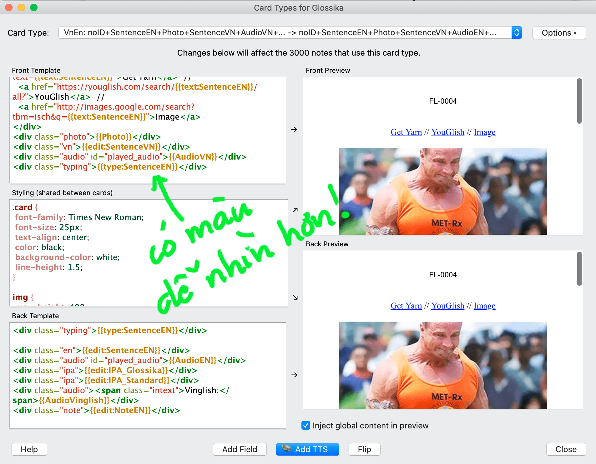
    

## Card Info During Review

* [Card Info During Review - AnkiWeb](https://ankiweb.net/shared/info/2179254157): `2179254157` 
    Hiện thông tin cards khi review, bằng cách chọn `Tools > Card Stats`, hoặc nhấp phím tắt tương ứng.
    
    

    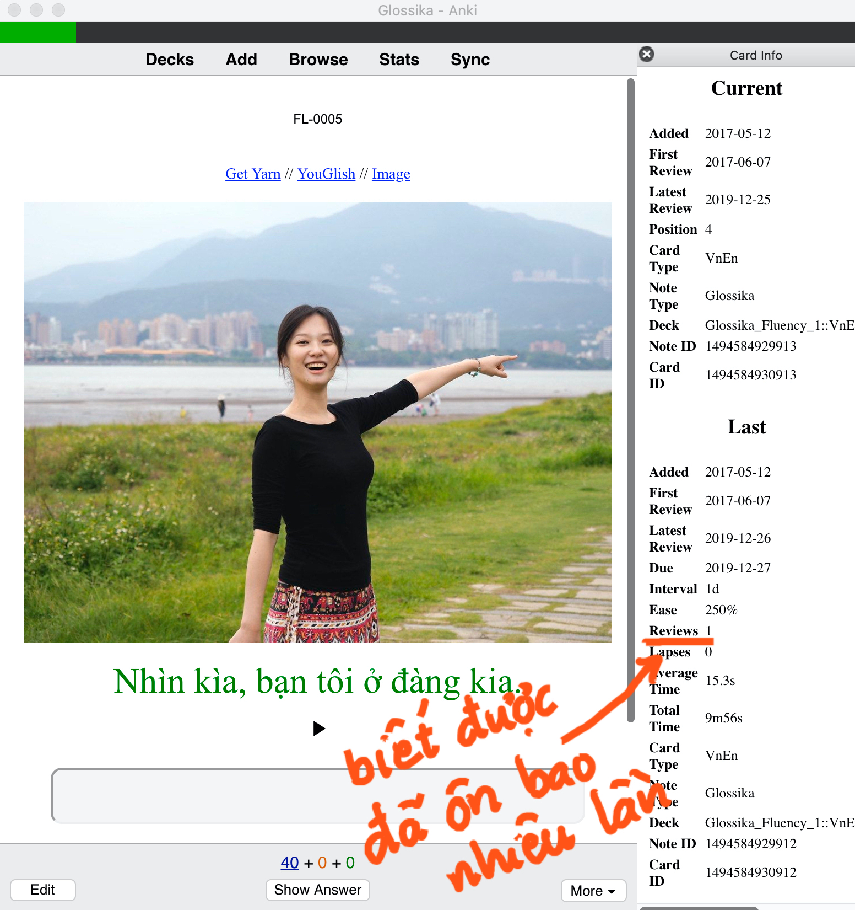
    

## Additional Card Fields

* [Additional Card Fields (Fork for 2.1) - AnkiWeb](https://ankiweb.net/shared/info/744725736): `744725736` 
    Hiện thêm thông tin cần thiết ngay trên card.

    

    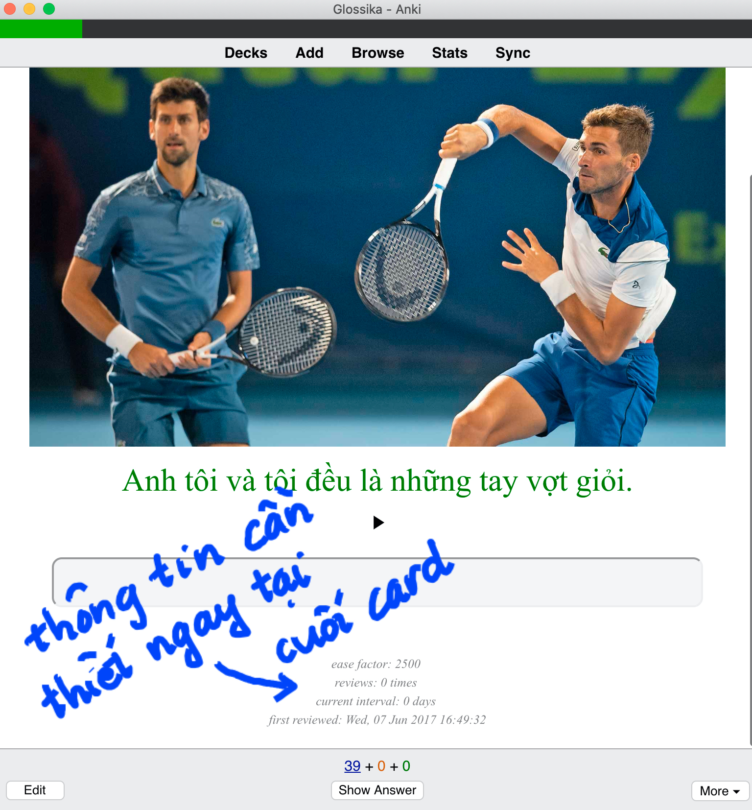
    

## Deck Stats

* [Deck Stats - AnkiWeb](https://ankiweb.net/shared/info/1421528223): `1421528223` 

  Hiện tổng số cards mới và tổng số cards cần ôn tập.

  

  
  

## More Overview Stats

* [More Overview Stats - AnkiWeb](https://ankiweb.net/shared/info/2116130837): `2116130837` 

  Hiện thêm một số thông tin tổng thể về từng bộ cards.

  

  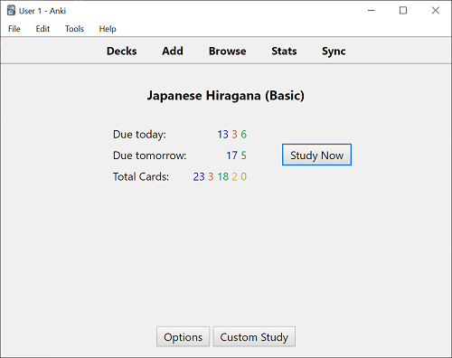  
  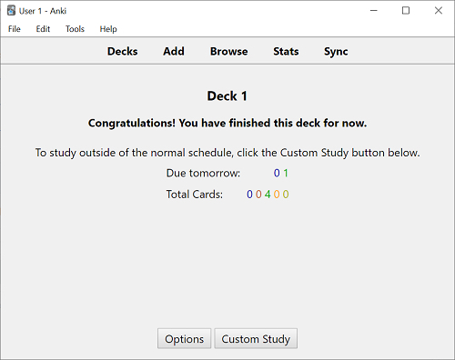
  

## Review Heatmap

* [Review heatmap](https://github.com/glutanimate/review-heatmap): 
    Add-on này cũng không cài được bằng code, cả nhà cần download file [tại đây](https://github.com/glutanimate/review-heatmap/releases), giống hướng dẫn bên dưới:
    
    

    
    

    
    Tiếp theo, cả nhà cài add-on bằng cách chọn `Tools > Add-ons` và kéo file vừa download vào giống thế này:
    
    

    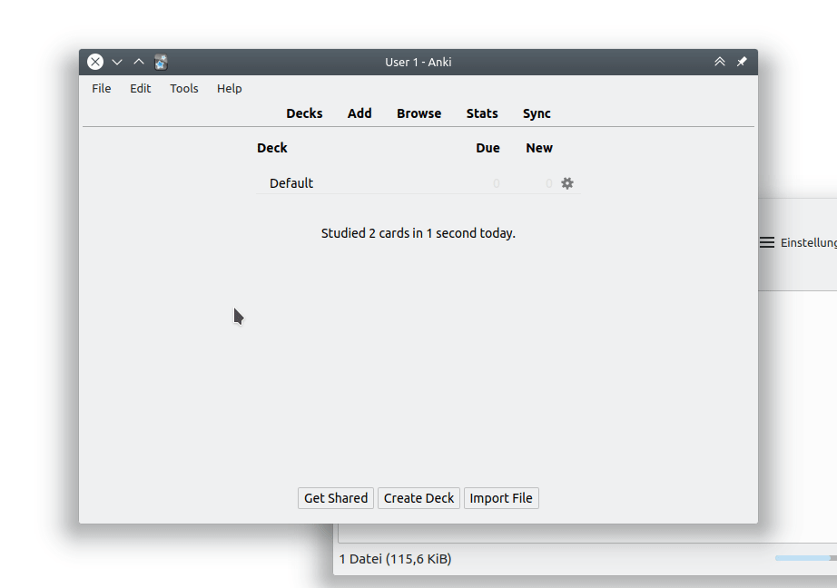
    

    Sau khi cài xong, tắt Anki đi bật lại cả nhà sẽ thấy `Heatmap` hiện ở cuối:

    

    
    

## Fastbar

* [Fastbar](https://ankiweb.net/shared/info/46611790): `46611790` 
    Cả nhà vào trong `Browse`, sẽ thấy `FastBar` hiện ra.

    

    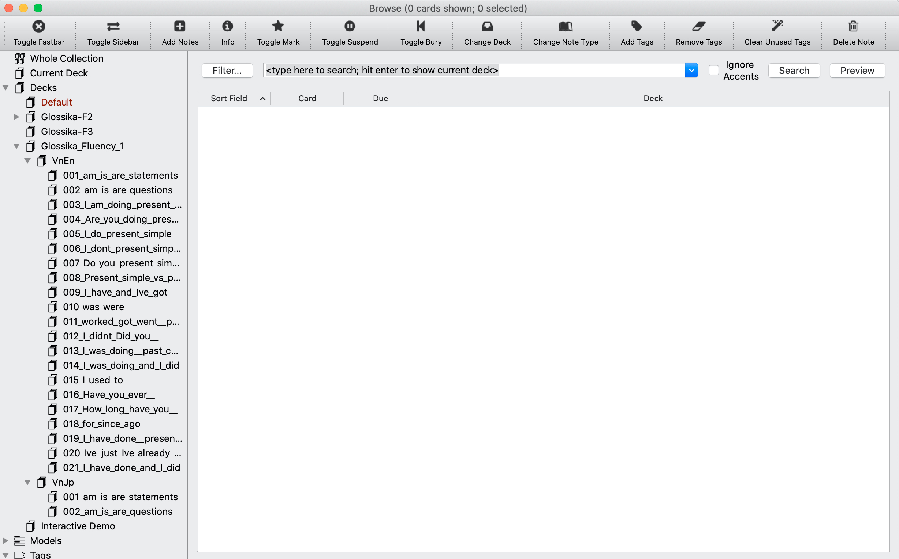
    

    
## Advanced Browser Sidebar

* [Blitzkrieg: Advanced Browser Sidebar - AnkiWeb](https://ankiweb.net/shared/info/564851917): `564851917` 
    Đổi tên, sắp xếp, chỉnh sửa options cho các bộ cards ngay trong browser.

    

    
    

## Advanced Browser

* [Advanced Browser - AnkiWeb](https://ankiweb.net/shared/info/874215009): `874215009` 
    Hiện thêm cột thông tin cho Browser.

    

    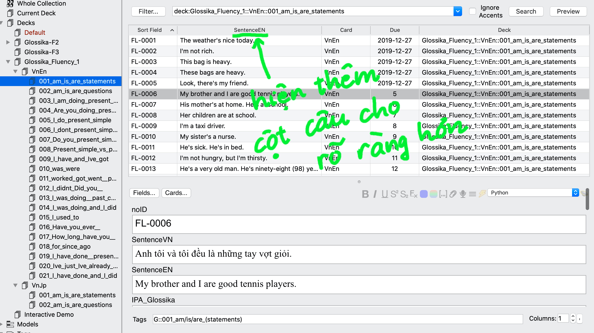
    

## Reset Card Scheduling

* [Reset Card Scheduling - AnkiWeb](https://ankiweb.net/shared/info/300884351): `300884351` 
    Reset lại các cards đã học.
    
    

    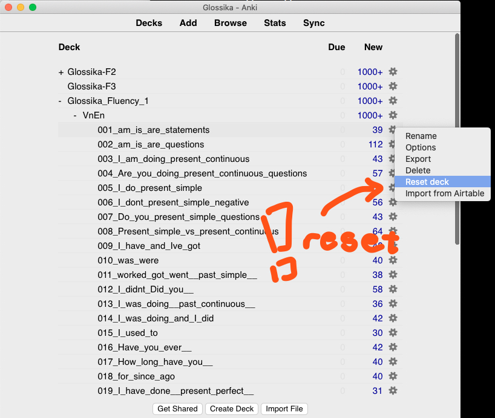
    

